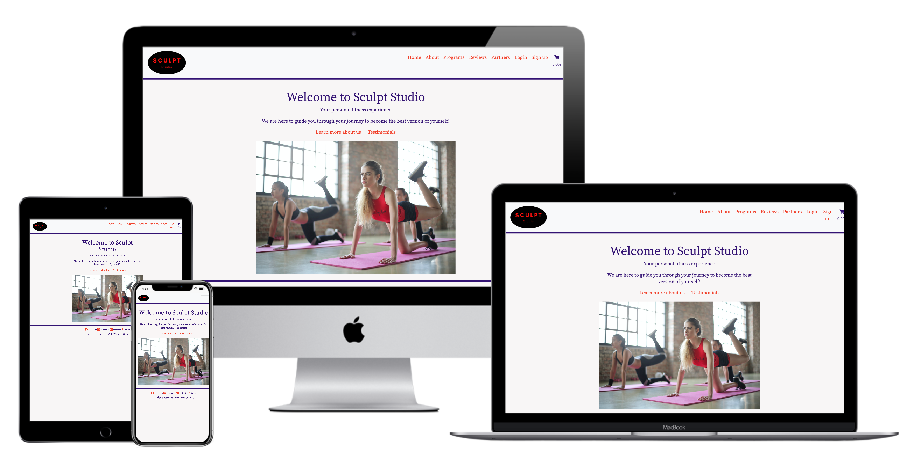

# Welcome to Sculpt Studio

This is my 4th milestone project for Code Institute, while being a school project i aim to eventually deploy this as a livesite. As the project for the school this is a MVP due to time restrictions.

- [Welcome to Sculpt Studio](#welcome-to-sculpt-studio)
  * [Project Goal](#project-goal)
    + [User Stories to support Project Goal](#user-stories-to-support-project-goal)
  * [Design](#design)
    + [Color and Fonts](#color-and-fonts)
    + [CLICK TO VIEW WIREFRAMES AND DATABASE DIAGRAM](#click-to-view-wireframes-and-database-diagram)
      - [Wireframes:](#wireframes-)
      - [Database Diagram:](#database-diagram-)
  * [Features](#features)
    + [For site user/client](#for-site-user-client)
      - [Booking meeting:](#booking-meeting-)
      - [Payment and Purchase:](#payment-and-purchase-)
    + [For site owner](#for-site-owner)
  * [Features left to implement in future releases](#features-left-to-implement-in-future-releases)

<small><i><a href='http://ecotrust-canada.github.io/markdown-toc/'>Table of contents generated with markdown-toc</a></i></small>

## Project Goal

The project aims to create a service through which Sculpt Studio owner can sell her fitness programs and services, user can create account to keep track of purhcases and admin can add / change / remove programs. Site users and people who purhcase programs can book meetings with the trainer to get personal service.

### User Stories to support Project Goal 

|   As a User                                                   |   So that                                                                     |
|---------------------------------------------------------------|-------------------------------------------------------------------------------|
|   I want to be able to purchase programs from the site        |   I can use the full offering of the company                                  |
|   I want to have a login to the site                          |   I can keep track off my purchases                                           |
|   I want to have a login to the site                          |   I can schedule calls                                                        |
|   I want to have a login to the site                          |   I can store my details for future purchases                                 |
|   I want the site to provide me with information              |   I can make a informed decision to participate and buy                       |
|   I want to be able to see the full offering                  |   I can choose the program that fits my needs                                 |
|   I want to be able to reset password                         |   I can login if I forget my password                                         |
|   I want to be able to schedule meetings                      |   I can take full advantage of programs                                       |
|   As a Site Owner                                             |                                                                               |
|   I want to sell my programs                                  |   I can grow my business                                                      |
|   I want to provide visitors with details and info about me   |   I can show my credentials and sell my programs                              |
|   I want to provide users with links to my social platforms   |   They can get inspired to develop themselves                                 |
|   I want the site to have a simple navigation and design      |   Users don’t leave the site because of unclear or complicated design         |
|   I want to be able to take payments                          |   I can make an income and ROI                                                |
|   I want to be able to advertise partnerships                 |   I can have an additional source of income from advertisements and partners  |
|   I want to have admin users on my site                       |   I can delegate the administration of the site                               |
|   I want the site to be mobile friendly                       |   Users can use my site cross platforms                                       |
|   I  want users to be able to book a call with my trainers    |   The time spent on scheduling is minimised                                   |
|   As a Admin User                                             |                                                                               |
|   I want to be able to delete programs                        |   I can keep offering up to date                                              |
|   I want to be able to add programs                           |   I can keep offering up to date                                              |
|   I want to be able to edit programs                          |   I can keep offering up to date                                              |
|   I want to be able to manage users                           |   I can have control over who can access the site                             |
|   I want to able to manually add users                        |   I can have profiles ready for new employees                                 |
|   I want to be able to manage partners page                   |   I am not dependant on development team                                      |
|                                                               |                                                                               |

## Design 

Design goal is to provide a simplistic web site with that is simple to use, is easy to understand and provide a good quality feeling. Site has been purposely designed and minimally filled not to retract from the user experience and to enable filling the site goals. 

### Color and Fonts

Fonts : Noto Serif JP 

Main color schema :
Background : rgb(248,246,246)
Font color 1 : rgb(239,64,41) 
Font color 2 : rgb(51,18,118) 
Font color 3 : rgb(0,0,0)

### CLICK TO VIEW WIREFRAMES AND DATABASE DIAGRAM

For wireframes Balsamiq has been used, there have been changed done during building the site. Overall wireframes were follow 
for the general desing. 

Design of Database was done using QuickDBD. 

#### Wireframes: 

#### Database Diagram: 

## Features 

### For site user/client

Users are able to create profile to the site to login and get access to current and future functionalities. Currently logged in users are able to view their account, update details such as current weight and height that helps personal trainers to better prepare for user sessions. User who have an account created are also able to purchase fitness programs using credit card.
Once users have purchase a program they will have purchase history available on their account, they can review the programs, also users that have a purchase made can be book a meeting with site trainer. Additionally all users, not only users with account created can access partners page through which they can access deals.

#### Booking meeting: 

To provide functionality to book meetings Calendly solution has been used. To test it is fine to create a purchase and after that book a meeting. 
Note: No contact will be currently made if a meeting request is received by site owner.

#### Payment and Purchase: 

Users who have created a profile can purchase fitness programs from the site. To test payment functionalities a user account should be created and test card used.

Test card to user:

Nr: 4242 4242 4242 4242 
Expiration: any future date
CVV: any 3 digit number

### For site owner

Site owner and admin users have extended access on the site. When they are logged in they are able to add, edit and/or delete fitness programs. Logged in admin users can also add, edit and/or delete partner deals via their account, for the admin users additional information is available on the partner pages, currently that info is contact info for potential partners/deals. To make admin users work easier they are able to manage all users by logging in and going on their account. There they can deactivate users, add users as superusers and see details about users that would make it easier for them to do their work on the website without using Admin portal. Then of course in the admin portal users with superuser access have access to the entire site info, such as purchases, users, testimonials etc. 
For testing purposes Admin user has been created: 
User: newadmin
password: kakapea1

## Features left to implement in future releases

A number of features have been cut from the current release due to time constraint. In the future, before the site will be made available for public use, the following features are considered to be implemented. However with the creation of business plan still in progress the features are not final.

* Calendar function for admin/trainers so they can easily see upcoming bookings
* Login functionality using social platforms such as Facebook, Google etc. 
* Additional details to profile such as images, tracking of program validity, lost/gained weight
* Meal plan functionality 
* Chat function
* Simple chat-bot 

## Testing

All testing on this was done manually. Click details to see testing write up

### Responsivness: 

Site was manually tested by using google developer tools to ensure responsivness. Mostly errors were found already during coding of the project and issues were solved at that stage. Site also tested by 4 volunteers on different devices and no major issues returned. Responsivness testing considered passed and good to enough to satisfy requirements for MVP / Project submition.

### Testing of different pages:

This section details testing done on different pages as different users.

#### Homepage / Landing page 

After landing on the site as a user who is not logged i tested links in the main content, navbar and footer on the page

- As not logged in user options available in navbar: Home, About, Programs, Reviews, Partners, Login, Sign up --> Passed
- As logged in user option available in navbar : Home, About, Programs, Reviews, Partners, Account, Log out --> Passed
- "Learn more about us" link directs to About us page --> Passed
- "Testimonials" link directs user to Reviews page --> Passed
- "Get started" call to action button redirects to programs page --> Passed
- "Social links" in the footer redirect respectively to each social media site --> Passed
- Logo redirects to home page --> Passed
- "home" redirects to home page --> Passed
- "about"  redirects to about me page --> Passed 
- "Programs" redirects to page where all programs are available --> Passed 
- "reviews" redirects to reviews/testimonials page --> Passed 
- "login" redirects to login page --> Passed 
- "Sign up redirects to sign up page --> Passed

#### About page

About page should show picture of the person behind Sculpt Studio concept and have link to programs, link function tested.

- "Checkout our programs" link redirects to programs page --> Passed

#### Programs page

Displays fitness programs available for purchase and provides different options depending on if you are logged in as admin or not logged in at all / logged in as site user. 

As a not logged in/logged in as site user the following tests done:

- "details" link redirects to programs details --> Passed
- "Add to Cart" links (if logged in user) adds product to cart, redirects to cart page and updates cart in navbar with total cost --> Passed
- "Add to Cart" links (if not logged in) transfers to sign in page, as user needs to be logged in for purchases --> Passed

As Admin user: 

Options available on the page change to back, edit, delete

- "Back" redirects back to user profile --> Passed
- "Edit" redirects to edit program form for updates --> Passed
- "Delete" deletes selected program --> Passed

#### Program details: 

Depending on if logged in as admin or not logged in/logged in as user different page option displayed.

As Admin: 

- To get to program details page admin needs to edit details on programs page : this is a fault in design and has been fixed by adding a link to program details also for admin user in the programs page --> Passed / Corrected 
- Links available for admin : Back, Edit, Delete --> Passed 
- "Back" redirects to profile page --> Passed
- "Edit" redirects to program form for updates --> Passed
- "Delete" deletes selected program --> Passed 

As user: 

- Links available : Back, Add to Cart --> Passed 
- "Back" redirects back to programs page
- "Add to Cart" links (if logged in user) adds product to cart, redirects to cart page and updates cart in navbar with total cost --> Passed

No logged in: 

Sames options as user 

- "Add to Cart" links (if not logged in) transfers to sign in page, as user needs to be logged in for purchases --> Passed

#### Reviews page 

Depending on if logged in as admin or not logged in/logged in as user different page option displayed.

As Admin:

- "Delete" allows to delete unsuitable reviews --> Passed

As User: 

No options, only possible to read reviews.

#### Partners page

Depending on if logged in as admin or not logged in/logged in as user different page option displayed.

As user / Not logged in:

- "Click here to shop" link redirects to homepage or respective partner --> Passed 

As admin: 

- "Edit" redirects to edit partner form --> Passed 
- "Delete" allows to delete selected partner from database --> Passed
- Information : as admin user additional information available about main contact at company in question --> Passed

#### Shopping cart: 

Shopping cart is where user is directed after choosing a program to purchase. 

- Options available Continue Shopping, Proceed to Checkout --> Passed
- "Continue Shopping" redirects back to programs page to be able to shop for other things --> Passed
- "Proceed to Checkout" directs user to purhcase page for payment with credit card --> Passed 
- If more than one program selected for purchase Total cost updates accordingly and both program display price, name and type--> Passed
- User can remove one item at a time from shopping cart by clicking Trash bin--> Passed 
- If user removes items total cost is updated accordingly , applies also for cart icon showing cost --> Passed

#### Purchase page / payment page

